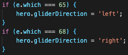

# GLIDE!

Glide ever downwards and reach the ground. Avoid the platforms, get power-ups, collect coins, get scored, and survive!

https://evan-woodworth.github.io/Glide/


# HOW TO PLAY

Simply select a difficulty and Glide!
- Change direction with [A] and [D].
- Stow your glider to fall faster!
  - Press [W] to stow your glider and hop upward.
  - Press [S] to stow your glider without hopping.
- Activate Power-ups that you collect with [Spacebar].


## Start Up Screen:


# HOW TO INSTALL

If you want to download this game, follow these steps:
1. *`Fork`* and *`Clone`* this respository to your local machine
2. Open `index.html` in your browser to play or 
3. Open the directory in your text editor of choice to view or edit the code


# HOW IT WORKS

Glide! is implemented using Javascript, HTML, CSS, and HTML Canvas.

## The Basics
When the page loads, an event begins the game loop interval. 


The game loop interval runs through all management and drawing functions.


The ```drawCanvas()``` function draws the background image, then interates through entity arrays and draws every entity that is "alive".


## Height Management and the "Scrolling" Effect

The ```manageHeight()``` function controls the vertical location of the background and all entities. The player does not change height, but rather, everything else changes around it.


The variables involved with fall speed calculations are accurately calculated using ```pixelRatio``` and ```loopSpeed```, to allow a realistic transition from gliding to falling as the glider is deployed or stowed:

```json
const pixelRatio = 10; //pixel to meter ratio
const loopSpeed = 50; //in milliseconds
/*  1 pixelRatio = 1m
    1 gameloop = loopSpeed ms
    acceleration due to gravity = 9.8m/s
    9.8(m/s)(1 pixelRatio / 1m)(1s / 1000ms)(loopSpeed / gameloop) = (playerAcceleration)px / gameloop */
const playerAcceleration = 9.8*(pixelRatio)*(1/1000)*(loopSpeed); //4.9 at 10px/50ms loopSpeed
/*  terminal velocity (vT) of a human is roughly 50.6m/s
    vT = 50.6(m/s)(pixelRatio px / 1m)(1s / 1000ms)(loopSpeed / gameloop) = 25.3 px/gameloop at 10px / 50ms loopSpeed */
const playerMaxFallSpeed = 50.6*(pixelRatio)*(1/1000)*(loopSpeed); //25.3 at 10px/50ms loopSpeed
let playerFallSpeed = -playerMaxFallSpeed;
const playerGliderSpeed = playerMaxFallSpeed-5; //player fall speed is significantly reduced by the glider
```

This portion of the ```manageHeight()``` function accounts for acceleration as the glider is stowed, causing the player's speed to change with each iteration of the game loop, until terminal velocity is reached:

```json
    if ( !playerGlider && glideReleaseSpeed > 0 ) {
        glideReleaseSpeed -= playerAcceleration;
        //until it reaches 0
        if ( glideReleaseSpeed < 0 ) {
            glideReleaseSpeed = 0;
        }
    }
```

## Collision Detection

If an entity enter's the player's height range, ```detectCollision()``` is called to determine if they collide.


The ```detectCollision()``` function is also used to determine if shots fired by the player hit any entities.
- The ```obj1``` parameter is an object representing the player, either the player's avatar or shots fired by the player.
- The ```collisionData``` parameter is an array of collision points to check against. Every entity has a built-in function to return collision data.


## Player Movement

The player moves side-to-side depending on the direction they are facing. The player changes direcion with the [A] and [D] keys.



Then, the ```manageGlide()``` function keeps the player moving in the same direction.


## Power-ups

Power-ups spawn randomly through-out the game, and the player can have one active power-up at a time. The player uses a power-up by pressing the spacebar, which either toggles an effect or creates a new entity, depending on the active power-up.


Then, anything that needs to be further managed is taken care of by the ```managePowerUp()``` function.


# FUTURE CONSIDERATIONS

Future goals for this project include:
- Designing more power-ups.
- Implementing enemies to thwart your progress.
- Adding an infinity mode, with no end goal and infinite lives.
